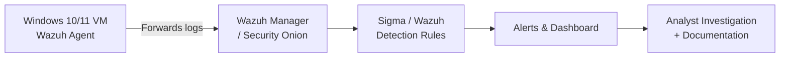

[README.md](https://github.com/user-attachments/files/30626065/README.md)
# Wazuh-Siem-Detection-Lab# Wazuh SIEM Detection Lab

## Overview

This repository documents a self-built home SOC lab used to practice detection
engineering: generating security telemetry, writing detection logic, and
investigating the resulting alerts end-to-end — from raw log to documented
incident.

The goal is to demonstrate the full SOC analyst workflow (not just tool
familiarity): ingest logs → detect → triage → document → map to MITRE ATT&CK.

## Scenario

A small environment (one Windows endpoint) is monitored by a SIEM. The lab
simulates common attacker behaviors (brute-force login attempts, suspicious
PowerShell execution, and scheduled-task persistence) and documents how each
would be detected and investigated by a SOC analyst.

## Lab Architecture

- **Endpoint:** Windows VM running the Wazuh agent (or Sysmon, log-forwarded to Security Onion)
- **SIEM:** Wazuh Manager (or Security Onion / Elastic stack)
- **Detection logic:** Custom rules + Sigma rules mapped to MITRE ATT&CK
- **Attack simulation:** Atomic Red Team test cases (see `scripts/simulate_attack.md`)

## Detections Implemented

| # | Detection | MITRE ATT&CK Technique | Write-up |
|---|---|---|---|
| 1 | Repeated failed logins (brute-force) | T1110 – Brute Force | [docs/detection-01-failed-login-bruteforce.md](docs/detection-01-failed-login-bruteforce.md) |
| 2 | Suspicious PowerShell execution (encoded command) | T1059.001 – PowerShell | [docs/detection-02-suspicious-powershell-execution.md](docs/detection-02-suspicious-powershell-execution.md) |
| 3 | Scheduled task persistence | T1053.005 – Scheduled Task | [docs/detection-03-scheduled-task-persistence.md](docs/detection-03-scheduled-task-persistence.md) |

## Skills Demonstrated

- SIEM configuration and log ingestion (Wazuh / Security Onion)
- Detection rule writing (Sigma format)
- Alert triage and incident investigation
- MITRE ATT&CK technique mapping
- Incident documentation and reporting

## Tools & Technologies

- Wazuh (or Security Onion)
- Sigma detection rules
- Sysmon
- Atomic Red Team (attack simulation)
- MITRE ATT&CK Navigator

## Setup Instructions

1. **Deploy the SIEM** — Install Wazuh (or Security Onion) in a VM. Wazuh's
   free all-in-one install is the fastest path: https://documentation.wazuh.com/current/quickstart.html
2. **Deploy a Windows endpoint** — Spin up a Windows 10/11 VM (VirtualBox or
   Hyper-V), install Sysmon (config: [SwiftOnSecurity's Sysmon config](https://github.com/SwiftOnSecurity/sysmon-config)
   is a good starting point) and the Wazuh agent, and point it at the manager.
3. **Simulate attacker behavior** — Use Atomic Red Team test cases matched to
   each technique above (see `scripts/simulate_attack.md`) to generate
   realistic telemetry.
4. **Write and tune detections** — Add the rules in `rules/` to your SIEM and
   confirm they fire against the simulated activity.
5. **Investigate and document** — For each alert, walk through triage exactly
   like a live incident and write it up in `docs/`, including timeline,
   evidence, and MITRE mapping.
6. **Capture evidence** — Save real screenshots of alerts/dashboards into
   `screenshots/` as you go (see that folder's README for what to capture).

## Author

Parin Bhikha
